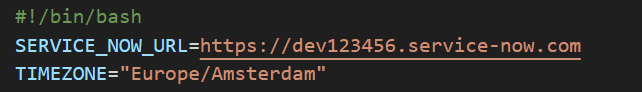

# ArgoCD Ephemeral Access Plugin for ServiceNow

[](https://github.com/FrederiqueRetsema/argocd-ephemeral-access-plugin-servicenow/actions/workflows/merge-to-main.yml)
[](https://raw.githack.com/wiki/frederiqueretsema/argocd-ephemeral-access-plugin-servicenow/coverage.html)

## Overview

The Ephemeral Access Extension
(<https://github.com/argoproj-labs/argocd-ephemeral-access>) is an add-on to
ArgoCD, which helps to implement least-privileged access control. Users of
ArgoCD can use read-only permissions by default, and then request more
permissions if they need to. The way permissions are processed is determined
by the plugin that is used.

This plugin provides the connection between the Ephemeral Access Extension
and ServiceNow. The plugin is developed using version v0.1.6 of the extension
and the Yokohama version of ServiceNow.

When a user does a request for more permissions, the plugin will connect to
ServiceNow. It checks the validity of the CI that is connected to the
application. When the CI is valid, the plugin will search for relevant changes.
When the change is found, the access will be granted. When no valid changes are
found, then the request will be denied.

### Valid CIs

A CI is valid, when the state of the CI is `Installed`, `In maintenance`,
`Pending install` or `Pending repair`.

### Valid changes

A change is valid, when the current date and time is within the range of the
start date and the end date. Apart from that, the change should have the
following properties:

* The state should be `Implement`
* The phase should be `Requested`
* The change should be `Approved`
* The change should be `Active`

To speed up the search of the ServiceNow API, both the start date and the end
date should be within (by default) one week. So when there is a valid change
from 1-1-2025 to 31-12-2025 and the current date is 31-05-2025, this change
will not be found by the plugin.

### Information in ServiceNow

When the access is granted, a note is created as part of the change in
ServiceNow. In this way, users of ServiceNow can see who got access to deal
with the change.

### Exclusion roles

When the ServiceNow API is not responding or when there is a big incident
that requires fast response, it might be useful to have a "work around" for
a limited number of employees. These employees can be part of a special
exclusion role.

When access is granted based on an exclusion role, a warning will be sent
to the logs.

## Demo

[](https://youtu.be/k6JqPJJJqb8)

## Prereqs

The ArgoCD Ephemeral Access Extension requires ArgoCD version v2.13.0+ to be
installed. This plugin has been tested with ArgoCD Ephemeral Access Extension
version v0.1.6, it is wise to install and test the Ephemeral Access Extension
without a plugin before installing the plugin.

## Installation

The installation requires you to change some settings in resources that are
deployed in the Ephemeral Access Extension. To do this properly, I created an
install script (install.sh). You can download it from the release page on
Github. Before you run this script, you have to change two settings:



Replace the ServiceNow URL with the URL of your ServiceNow environment. Also
replace the timezone for the plugin (this should match the timezone of the
user that the plugin uses for reading the CI and for reading and writing the
change).

After the installation, you need to configure the userid and the password for
ServiceNow. The plugin uses a secret to get this information:

```Kubectl
kubectl create secret -n argocd-ephemeral-access generic servicenow-secret \ 
  --from-literal=username=plugin_user --from-literal=password=plugin_password
```

You now have to label the application that you want to check in ServiceNow with
the CI name: by default the name of the label is ciName, but you can change
this if you want.

An example application:

```Manifest
apiVersion: argoproj.io/v1alpha1
kind: Application
metadata:
    name: demoapp
    namespace: argocd
    labels:
        environment: production
        ciName: app-demoapp
```

You will always have one label that is used by the Ephemeral Access Extension
to indicate that this application should be under control of the extension and
another label that is used by the ServiceNow plugin to know which CI should be
checked and which changes should be requested.

You can change settings if you like, you can look at all the settings on the
[settings](./SETTINGS.md) page. The way to configure exclusion roles is also
explained on this page.

## Determining the duration of the permission

Currently, the Ephemeral Access Extension determines how long the permission is
granted. This is not what one would expect when the change ends earlier. This
will be solved in a comming release of the Ephemeral Access Extension (*). Until
then, this plugin uses a work around.

When the duration of the Ephemeral Access Extension is shorter than the duration
of the change, the duration of the Ephemeral Access Extension will be used. The
extension will then also remove the permission on the right moment. When the
duration of the Ephemeral Access Extension is longer than the duration of the
change, then the plugin will remove the AccessRequest when the change time is
reached.

To make this happening, a CronJob is created, that will delete the access
request. When the AccessRequest is successfully removed, then the CronJob itself
will be removed as well.

When the Ephemeral Access Extension comes with a new releas that solves this
issue, then this workaround will be removed.

(*) See
[issue 101](https://github.com/argoproj-labs/argocd-ephemeral-access/issues/101)
of the Ephemeral Access Extension

## Versioning

### Patch releases: for example v0.0.0 to v0.0.1

We are using Renovate for automatically receiving updates of go modules etc.
This means that when the last number of a version is changing (f.e.
v0.0.0 to v0.0.1) then no other changes than updating versions took place.

### Minor releases: for example v0.0.0 to v0.1.0

When the plugin itself changes, for example when the Ephemeral Access
Extension releases a new version where this plugin can get rid of work
arounds, then a new minor release will be created.

### Major releases: for example v0.0.0 to v1.0.0

When the plugin changes with breaking changes (f.e. when configuration
currently is in environment variables, but in a new release the same
configuration is in a configmap), then the version will bump with a major
release number.

Please mind, that bumping up a major release number doesn't say anything
about the amount of changes, or the amount of changed functionality that
is in the release

### No version changes for documentation

When documentation or demo code is changed and the plugin itself
remains the same, then the version number is not changed.
