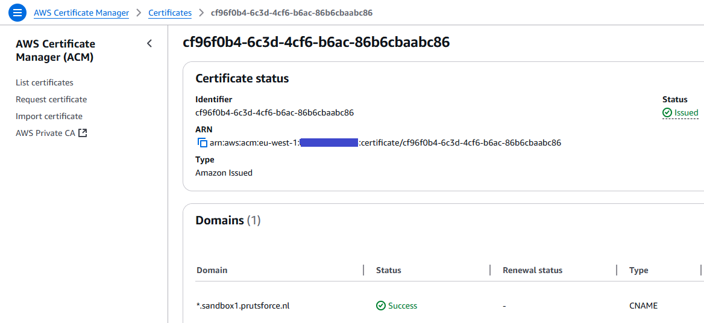

# ArgoCD Ephemeral Access Extension Plugin for ServiceNow

## Introduction

## ArgoCD Ephemeral Access Extension

## ArgoCD Ephemeral Access Extension Plugin for Topdesk

## Installation

## AWS CloudFormation

AWS CloudFormation can be used to deploy AWS resources using CloudFormation
templates. In this example I’m using AWS CloudFormation to deploy an AWS
Cognito userpool with one user in one group. The template also deployes
three EC2 nodes. I’m using cfn-init to put the configuration files in
the /opt/xforce directory. Data from different resources is injected in these
configuration files by a configuration script. This script also installs
argocd and the argocd ephemeral access extension. It also starts the build of
the plugin, this plugin will be stored in AWS ECR. I'm using nerdctl and
buildkit to build the plugin image during the start of the control node.

You can use this CloudFormation script yourself to deploy this example to
your own AWS environment. To use it, first create a temporary bucket for
CloudFormation and change the parameters in the script to use your own
profile and name. You also need an certificate ID from AWS Certificate
Manager, in my case I used a star certificate for __*.sandbox1.prutsforce.nl__.

## Conclusion

## Links

[1] Github repo:  
[2] Github repository of the Ephemeral Access Extension:
<https://github.com/argoproj-labs/argocd-ephemeral-access>  
