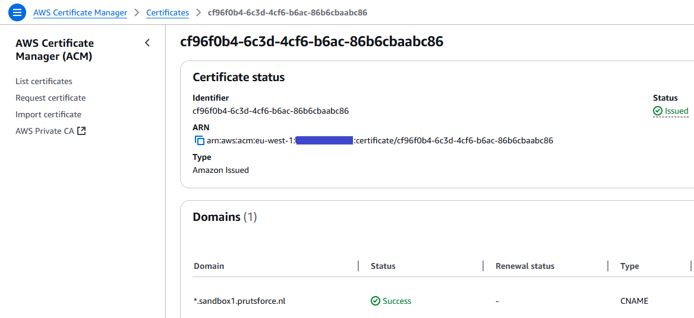

# AWS Development template

## Introduction

The CloudFormation template in this directory can be used to develop or enhance
the Ephemeral Access Extension plugin for ServiceNow. The cloudformation
template will build the plugin from the Dockerfile and store the container
image in AWS ECR when the Virtual Machine is started. The virtual machine
contains tools to rebuild the plugin and deploy new manifest files as well.

## Installation

### Start and stop scripts

First log in to your account, then use the `start-k8s.sh` and `stop-k8s.sh`
scripts to start and stop the development environment. You need to change some
parameters in these scripts, for example the `profile name` of your environment.

The `consultant name` is used for both the stack name in AWS and for the user
name in the virtual machine.

The `consultant email` is used for AWS Congito: it will send you an email with
the initial password.

`Group name` is used for the AWS Cognito group name that will be used for this
example. It will also be used in the Virtual Machine for the Kubernetes
manifests to give this group permissions within the Ephemeral Access Extension.

`Hosted zone name` is the hosted zone name in Route53 within your AWS
environment. It is used to access the ArgoCD website for the cluster.

`Certificate ID` is the ID of the certificate that will be used for the argocd
website. It can be a star certificate (f.e. *.sandbox2.prutsforce.nl) or a
specific certificate (f.e. argocd.sandbox2.prutsforce.nl).

`Default password` is the initial password for your user on the nodes. Please
change this for your own environment.

`ServiceNow secret name` is the name that you want to use for the secret that
contains the username and password for the ServiceNow environment. You can
create one or find it back in the AWS Certificate Manager service:



`ServiceNow URL` is the URL to your ServiceNow environment. You can use a free
developer subscription if you don't have a ServiceNow environment yourself,
request one at <https://developer.servicenow.com/dev.do>.

`Local Timezone` is the timezone which is used in ServiceNow. The plugin should
use the same timezone as ServiceNow (the timezone of the server can be different).

### Initialization in the virtual machine

After you log on, you need to install the secret for ServiceNow. This can be
done with the following command (change the password):

```kubernetes
kubectl create secret -n argocd-ephemeral-access generic servicenow-secret \
  --from-literal=username=admin \
  --from-literal=password=ABc@defC1D3%
```

## Tools

When I'm developing, I'm using the root user and I'm going to the directory
where the github repository is cloned into. In my environment this is in the
`/clone/argocd-ephemeral-access-plugin-servicenow` directory.

You can change the code in the `cmd/main.go` file. You can copy/paste the code
from the IDE on your local machine to this file, using vi.

When you changed the code, you can use the `r` alias to rebuild the plugin.
After that, the `d` alias will delete the controller pod and delete all
AccessRequests in the (by default) argocd namespace.

When you deleted the pod, it will take some time for the deployment to start a
new instance of the pod. You can see how the pod restarts using `g`, which will
get the pods in the `argocd-ephemeral-access` namespace.

Finally, when you requested permissions, you may want to see the logging of the
controller pod. This can be done with `l`.

Summary:

| Name | Purpose                      | Path                   |
|------|------------------------------|------------------------|
|  r   | rebuild plugin               | /opt/xforce/rebuild.sh |
|  d   | delete pods + accessrequests | /opt/xforce/d          |
|  g   | get pods and wait            | /opt/xforce/g          |
|  l   | get logs of controller pod   | /opt/xforce/l          |
